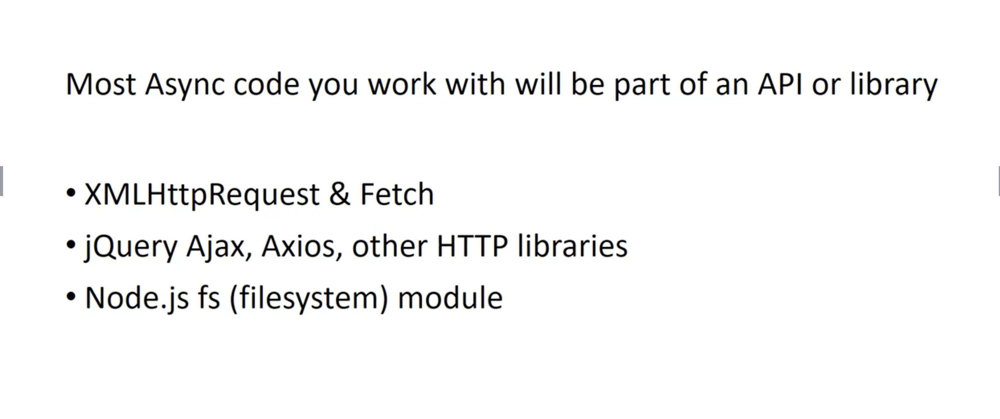
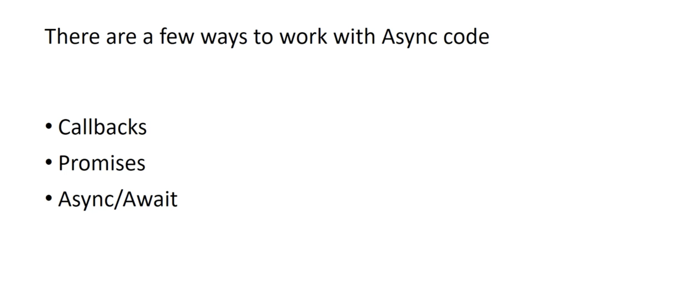
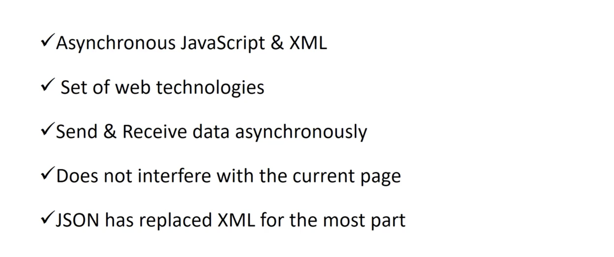
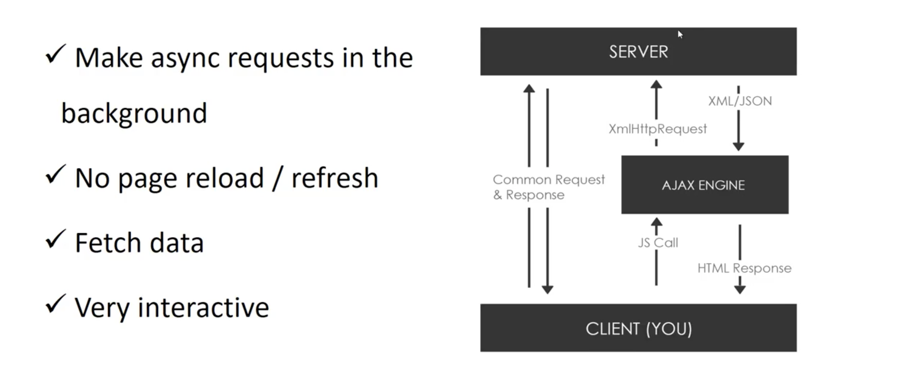
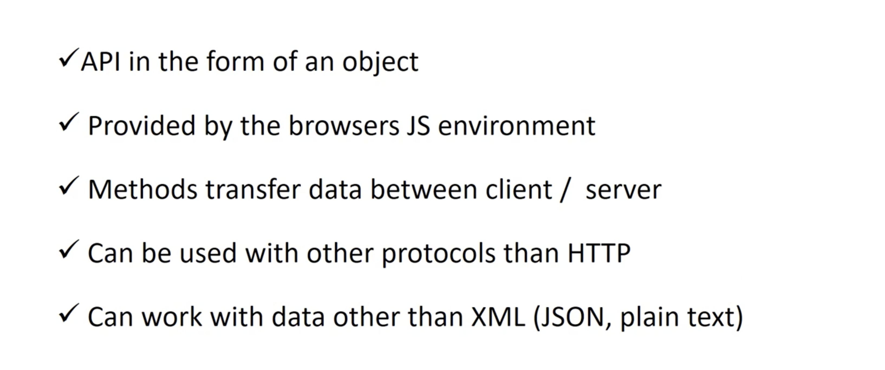
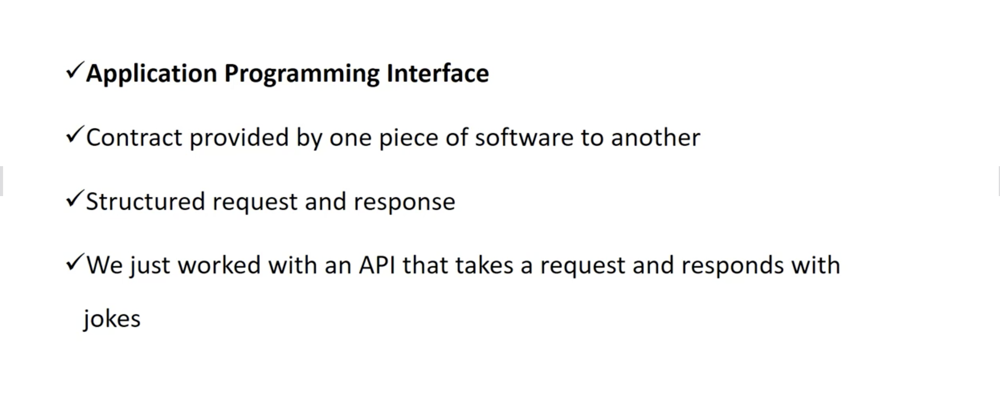

## Synchronous vs Async Programming

### Synchronous Programming

### Asynchronous Programming

### working with Async Code

### What is AJAX?

### XMLHttpRequest (XHR) Object

### Other Libraries and API's

### What is an API?

### What are REST API's

### HTTP Requests

### API Endpoints

