## 1. Table of Contents

- [1. Table of Contents](#1-table-of-contents)
- [2. 5 Types of Primitive Types](#2-5-types-of-primitive-types)
  - [2.0.1. Technically there are 2 more: Symbol & BigInt](#201-technically-there-are-2-more-symbol--bigint)
- [3. Numbers](#3-numbers)
- [4. Variables](#4-variables)
  - [4.1. Let](#41-let)
  - [4.2. Const](#42-const)
  - [4.3. Var](#43-var)
    - [4.3.1. Use Cases](#431-use-cases)
  - [4.4. Boolean](#44-boolean)
  - [4.5. String](#45-string)
    - [4.5.1. String Properties](#451-string-properties)
    - [4.5.2. Some String Methods](#452-some-string-methods)
      - [4.5.2.1. Using substring()](#4521-using-substring)
      - [4.5.2.2. Using substring() with length property](#4522-using-substring-with-length-property)
      - [4.5.2.3. The difference between substring() and substr()](#4523-the-difference-between-substring-and-substr)
      - [4.5.2.4. Differences between substring() and slice()](#4524-differences-between-substring-and-slice)
  - [4.6. Template Literals](#46-template-literals)
  - [4.7. Math Object](#47-math-object)
  - [4.8. TypeOf Operator](#48-typeof-operator)
  - [4.9. parseInt & parseFloat](#49-parseint--parsefloat)
  - [4.10. Type Conversion](#410-type-conversion)
- [5. Conditionals](#5-conditionals)
  - [5.1. Equality](#51-equality)
    - [5.1.1. Double Equals](#511-double-equals)
    - [5.1.2. Triple Equals](#512-triple-equals)
    - [5.1.3. Comparison](#513-comparison)
    - [5.1.4. Running Code in a Script](#514-running-code-in-a-script)
  - [5.2. Truthy & Falsy ness](#52-truthy--falsy-ness)
  - [5.3. Operator Precedence](#53-operator-precedence)
  - [5.4. Switch](#54-switch)
  - [5.5. When to Use and When Not-To Use Break](#55-when-to-use-and-when-not-to-use-break)
  - [5.6. Ternary Operator](#56-ternary-operator)
- [6. Arrays](#6-arrays)
  - [6.1. Ordered Collection of Values](#61-ordered-collection-of-values)
  - [6.2. Modifying Arrays](#62-modifying-arrays)
    - [6.2.1. Basic Array Methods](#621-basic-array-methods)
      - [6.2.1.1. Shift and Unshift](#6211-shift-and-unshift)
      - [6.2.1.2. Some More Methods](#6212-some-more-methods)
      - [6.2.1.3. Concat](#6213-concat)
      - [6.2.1.4. Includes](#6214-includes)
      - [6.2.1.5. Index Of](#6215-index-of)
      - [6.2.1.6. Reverse](#6216-reverse)
      - [6.2.1.7. Join](#6217-join)
      - [6.2.1.8. Slice](#6218-slice)
      - [6.2.1.9. Splice](#6219-splice)
      - [6.2.1.10. Sort](#62110-sort)
  - [6.3. Reference Types](#63-reference-types)
    - [6.3.0.1. By default,data is stored is a Value-Type.](#6301-by-defaultdata-is-stored-is-a-value-type)
    - [6.3.1. Value Types vs Reference Types](#631-value-types-vs-reference-types)
      - [6.3.1.1. Changing arrays with Const](#6311-changing-arrays-with-const)
      - [6.3.1.2. Nested Arrays](#6312-nested-arrays)
- [7. Objects](#7-objects) - [7.0.0.0.1. Properties](#70001-properties)
  - [7.0.1. Creating Object Literals](#701-creating-object-literals)
    - [7.0.1.1. Accessing Objects in a different way](#7011-accessing-objects-in-a-different-way)
    - [7.0.1.2. Updating & Adding Properties](#7012-updating--adding-properties)
    - [7.0.1.3. Nested Arrays & objects](#7013-nested-arrays--objects)
  - [7.0.2. Objects and Reference Types](#702-objects-and-reference-types)
  - [7.0.3. Array/Object Equality](#703-arrayobject-equality)
- [8. The World of Loops](#8-the-world-of-loops)
  - [8.1. For Loop](#81-for-loop)
  - [8.2. For Loop & Arrays](#82-for-loop--arrays)
  - [8.3. Nested For-Loops](#83-nested-for-loops)
  - [8.4. While Loops](#84-while-loops)
  - [8.5. Break Keyword](#85-break-keyword)
  - [8.6. For…of Loop](#86-forof-loop)
    - [8.6.1. For…of Loop for Objects](#861-forof-loop-for-objects)
    - [8.6.2. For…in Loop](#862-forin-loop)
- [9. Functions](#9-functions)

## 2. 5 Types of Primitive Types

1. Number
2. String
3. Boolean
4. Null
5. Undefined

#### 2.0.1. Technically there are 2 more: Symbol & BigInt

## 3. Numbers

1. JS has only 1 numbers, (as opposed to java,and C++ where we have int,float,
   double etc.), which can be whole numbers, integers ( + / - ), and decimal
   numbers
2. Does not store infinitely precise numbers (eg. 1.00090909090903 will give
   output **1**)
3. 5 \*\* 2 = 5 to the power 2 = 25
4. Arithmetic Operations follow BODMAS rule
5. NaN = Not a number
   1. 0 / 0 = NaN
   2. 1 + NaN = NaN
   3. 1/0 = Infinity (there‘s no way to store Infinity)
   4. -0 = -0 (This has its own value in JavaScript, Super Weird!)

## 4. Variables

### 4.1. Let

1. Reserved Keyword

### 4.2. Const


### 4.3. Var

1. It makes no sense to use it now-a-days. (Its the old way of using it)


#### 4.3.1. Use Cases

```javascript
//var, let, const
//VAR - Function Scoped
var name = 'John Doe';
console.log(name);
name = 'Steve Smith';
console.log(name);

// Init var
var greeting;
console.log(greeting);
greeting = 'Hello';
console.log(greeting);

// You can also simply assign a value to a variable For example,

x = 42;

// This form creates an undeclared global variable. It also generates a strict JavaScript warning. Undeclared global variables can often lead to unexpected behavior. Thus, it is discouraged to use undeclared global variables.

// letters, numbers, _, $
// Can not start with number

// Multi word vars
var firstName = 'John'; // Camel case
var first_name = 'Sara'; // Underscore
var FirstName = 'Tom'; // Pascal case
var firstname;

// LET - Block Scoped
let name;
name = 'John Doe';
console.log(name);
name = 'Steve Smith';
console.log(name);

// CONST - Block Scoped | Cannot be reassigned
const name = 'John';
console.log(name);
//Can not reassign
name = 'Sara';
//Have to assign a value
const greeting;


// Variable Scope:

// JavaScript before ECMAScript 2015 does not have block statement scope. Rather, a variable declared within a block is local to the function (or global scope) that the block resides within.

// For example, the following code will log 5, because the scope of x is the global context (or the function context if the code is part of a function). The scope of x is not limited to the immediate if statement block.

if (true) {
  var x = 5;
}
console.log(x);  // x is 5

//This behavior changes when using the let declaration (introduced in ECMAScript 2015).

if (true) {
  let y = 5;
}
console.log(y);  // ReferenceError: y is not defined
```

### 4.4. Boolean

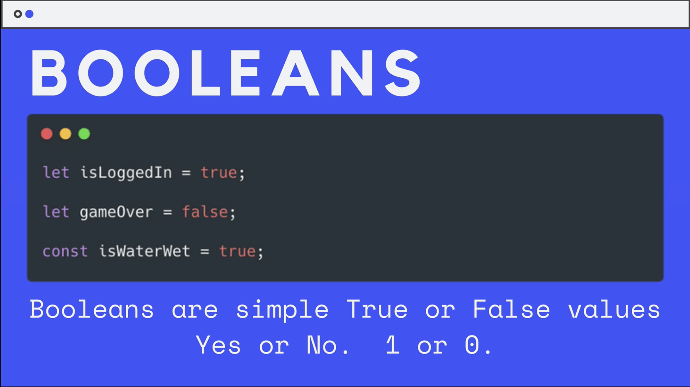


### 4.5. String

1. Be consistent with quotes!
   

#### 4.5.1. String Properties

1. `.length` property is used to access length of a string.
2. Strings are immutable. (A string characters cannot be changed/manipulated)
3. Every method on string does not change the string itself

   ```javascript
   let str = "Hello";
   str.toUpperCase(); // This will return "HELLO" but value of str will still remain "Hello"
   ```

#### 4.5.2. Some String Methods

```js
// STRING METHODS AND CONCATENATION

const firstName = "William";
const lastName = "Johnson";
const age = 36;
const str = "Hello there my name is Brad";
const tags = "web design,web development,programming";

let val;

val = firstName + lastName; // O/P: "WilliamJohnson"

// Concatenation
val = firstName + " " + lastName; // O/P: "William Johnson"

// Append
val = "Brad ";
val += "Traversy"; // O/P: "Brad Traversy"

val = "Hello, my name is " + firstName + " and I am " + age;

// Escaping Characters
val = "That's awesome, I can't wait"; // O/P: "That's awesome, I can't wait" Notice that even though there are single quotes inside the double quotes, js treats them as characters
//Conversely this can also be written as val='That"s Awesome, I can"t wait' and this time double-quotes will be treated as characters

// Length
val = firstName.length; // O/P: 7

// concat()
val = firstName.concat(" ", lastName); // O/P: "William Johnson"

// Change case
val = firstName.toUpperCase(); // O/P: "WILLIAM"
val = firstName.toLowerCase(); // O/P: "william"

val = firstName[2]; // O/P: "l"

// indexOf()
val = firstName.indexOf("l"); // O/P: 2
val = firstName.lastIndexOf("l"); // O/P: 3

// charAt()
val = firstName.charAt("2"); // O/P: "l"
```

##### 4.5.2.1. Using substring()

The following example uses substring() to display characters from the string
‘Mozilla’:

```js
let anyString = "Mozilla";

// Displays 'M'
console.log(anyString.substring(0, 1));
console.log(anyString.substring(1, 0));

// Displays 'Mozill'
console.log(anyString.substring(0, 6));

// Displays 'lla'
console.log(anyString.substring(4));
console.log(anyString.substring(4, 7));
console.log(anyString.substring(7, 4));

// Displays 'Mozilla'
console.log(anyString.substring(0, 7));
console.log(anyString.substring(0, 10));
```

##### 4.5.2.2. Using substring() with length property

The following example uses the substring() method and length property to extract
the last characters of a particular string. This method may be easier to
remember, given that you don‘t need to know the starting and ending indices as
you would in the above examples.

```js
// Displays 'illa' the last 4 characters
let anyString = "Mozilla";
let anyString4 = anyString.substring(anyString.length - 4);
console.log(anyString4);

// Displays 'zilla' the last 5 characters
let anyString = "Mozilla";
let anyString5 = anyString.substring(anyString.length - 5);
console.log(anyString5);
```

##### 4.5.2.3. The difference between substring() and substr()

There‘s a subtle difference between the substring() and substr() methods, so you
should be careful not to get them confused.

The arguments of substring() represent the starting and ending indexes, while
the arguments of substr() represent the starting index and the number of
characters to include in the returned string.

Furthermore, substr() is considered a legacy feature in ECMAScript and could be
removed from future versions, so it is best to avoid using it if possible.

```js
let text = "Mozilla";
console.log(text.substring(2, 5)); // => "zil"
console.log(text.substr(2, 3)); // => "zil"
```

##### 4.5.2.4. Differences between substring() and slice()

The substring() and slice() methods are almost identical, but there are a couple
of subtle differences between the two, especially in the way negative arguments
are dealt with.

The substring() method swaps its two arguments if indexStart is greater than
indexEnd, meaning that a string is still returned. The slice() method returns an
empty string if this is the case.

```js
let text = "Mozilla";
console.log(text.substring(5, 2)); // => "zil"
console.log(text.slice(5, 2)); // => ""
```

If either or both of the arguments are negative or NaN, the substring() method
treats them as if they were 0.

```js
console.log(text.substring(-5, 2)); // => "Mo"
console.log(text.substring(-5, -2)); // => ""
```

slice() also treats NaN arguments as 0, but when it is given negative values it
counts backwards from the end of the string to find the indexes.

```js
console.log(text.slice(-5, 2)); // => ""
console.log(text.slice(-5, -2)); // => "zil"
```

### 4.6. Template Literals

```js
// TEMPLATE LITERALS

const name = "John";
const age = 31;
const job = "Web Developer";
const city = "Miami";
let html;

// Without template strings (es5)
html =
  "<ul><li>Name: " +
  name +
  "</li><li>Age: " +
  age +
  " </li><li>Job: " +
  job +
  " </li><li>City: " +
  city +
  " </li></ul>";

html =
  "<ul>" +
  "<li>Name: " +
  name +
  "</li>" +
  "<li>Age: " +
  age +
  "</li>" +
  "<li>Job: " +
  job +
  "</li>" +
  "<li>City: " +
  city +
  "</li>" +
  "</ul>";

function hello() {
  return "hello";
}

// With template strings (es6)
html = `
  <ul>
    <li>Name: ${name}</li>
    <li>Age: ${age}</li>
    <li>Job: ${job}</li>
    <li>City: ${city}</li>
    <li>${2 + 2}</li>
    <li>${hello()}</li>
    <li>${age > 30 ? "Over 30" : "Under 30"}</li>
  </ul>
`;
```

Null & Undefined

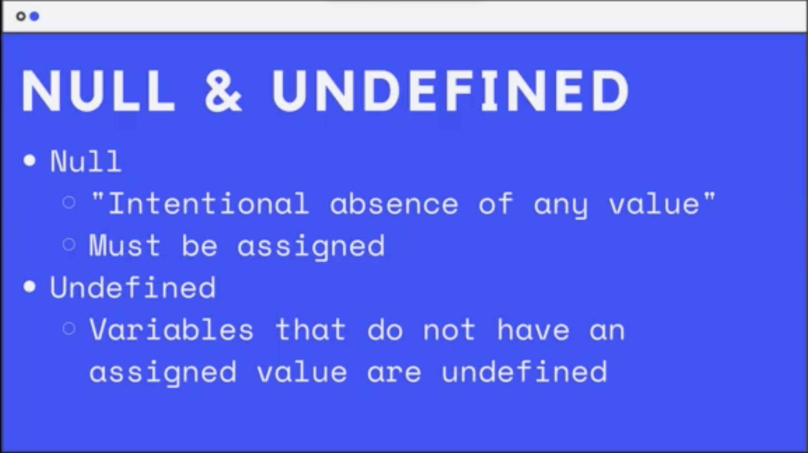

### 4.7. Math Object

```js
// NUMBERS AND THE MATH OBJECT

const num1 = 100;
const num2 = 50;
let val;

// Simple math with numbers
val = num1 + num2;
val = num1 * num2;
val = num1 - num2;
val = num1 / num2;
val = num1 % num2;

// Math Object Methods
val = Math.PI;
val = Math.E;
val = Math.round(2.4);
val = Math.ceil(2.4);
val = Math.floor(2.8);
val = Math.sqrt(64);
val = Math.abs(-3);
val = Math.pow(8, 2);
val = Math.min(2, 33, 4, 1, 55, 6, 3, -2);
val = Math.max(2, 33, 4, 1, 55, 6, 3, -2);
val = Math.random();

val = Math.floor(Math.random() * 20 + 1);
```

### 4.8. TypeOf Operator

1. `typeOf` is an operator, to reutrn the variable type.
2. Use:
   ```js
   str = "Hello"
   typeOf str // O/P: String
   ```

### 4.9. parseInt & parseFloat

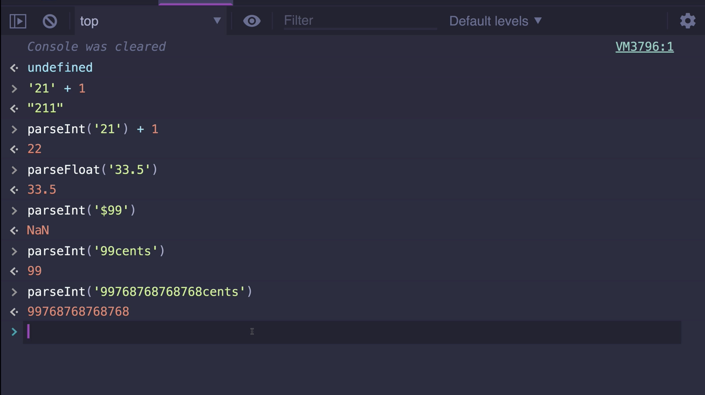

### 4.10. Type Conversion

```js
// TYPE CONVERSION

let val;

// Number to string
val = String(555);
val = String(4 + 4);
// Bool to string
val = String(true);
// Date to string
val = String(new Date());
// Array to string
val = String([1, 2, 3, 4]);

// toString()
val = (5).toString();
val = true.toString();

// String to number
val = Number("5");
val = Number(true);
val = Number(false);
val = Number(null);
val = Number("hello");
val = Number([1, 2, 3]);

val = parseInt("100.30");
val = parseFloat("100.30");
```

## 5. Conditionals

### 5.1. Equality

#### 5.1.1. Double Equals

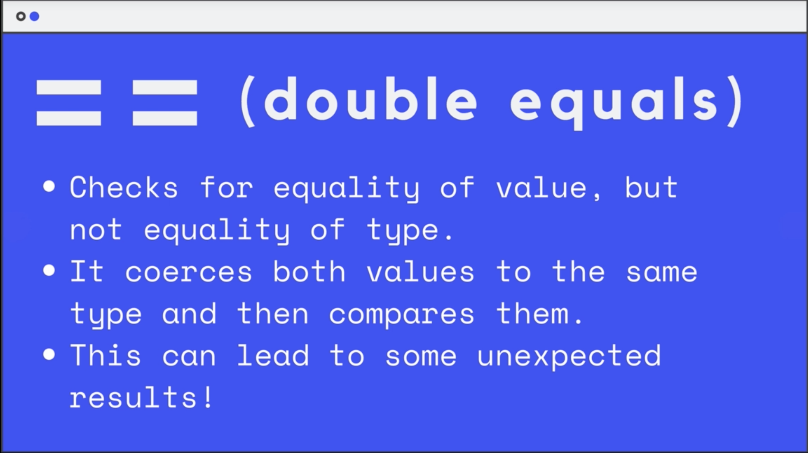


#### 5.1.2. Triple Equals

> Also called Strict Equality Operator
> 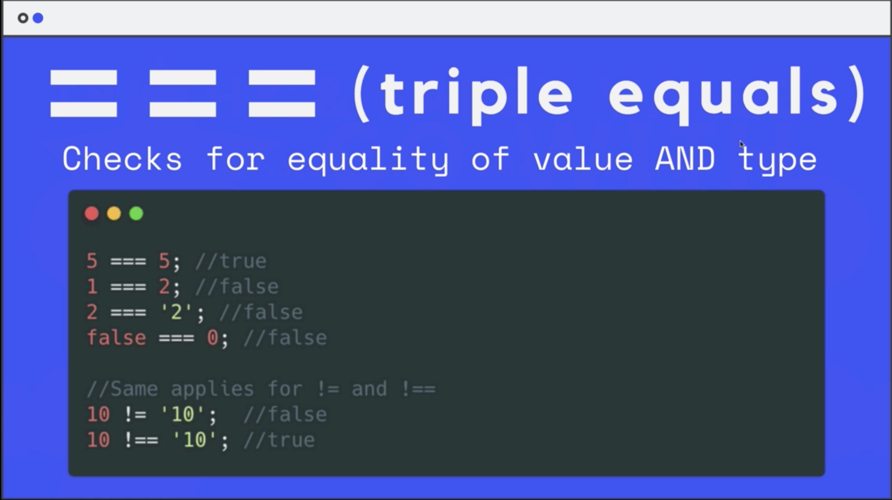

#### 5.1.3. Comparison


#### 5.1.4. Running Code in a Script


### 5.2. Truthy & Falsy ness


### 5.3. Operator Precedence


### 5.4. Switch

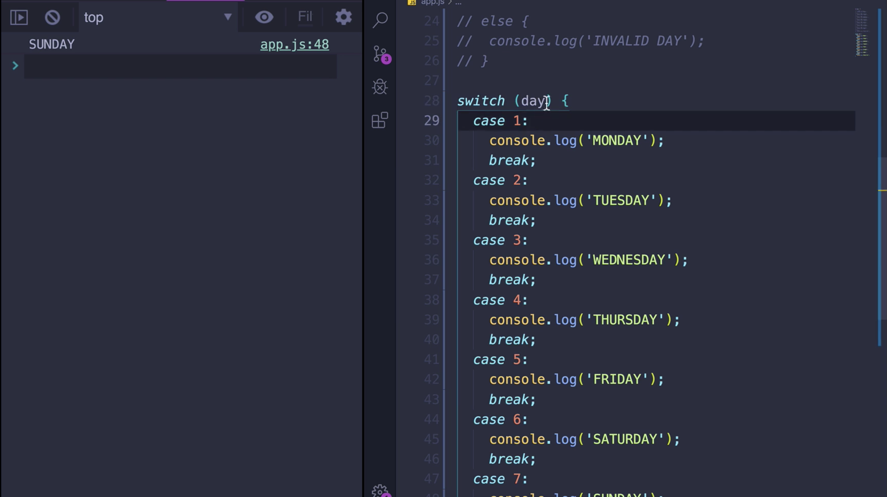

### 5.5. When to Use and When Not-To Use Break


### 5.6. Ternary Operator

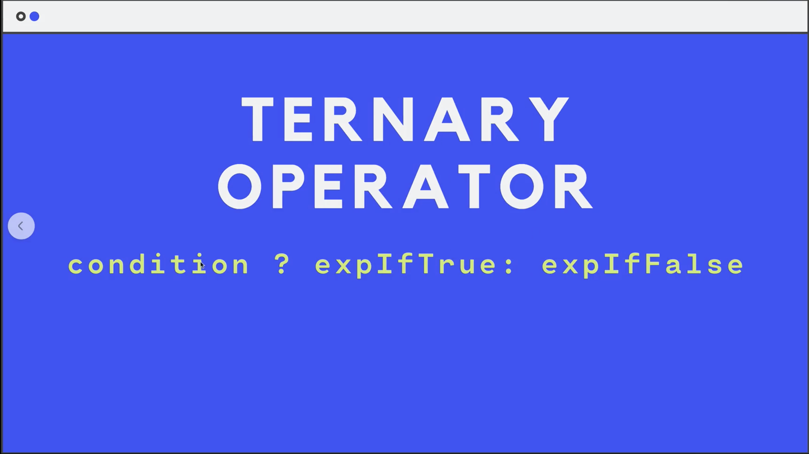


## 6. Arrays

### 6.1. Ordered Collection of Values


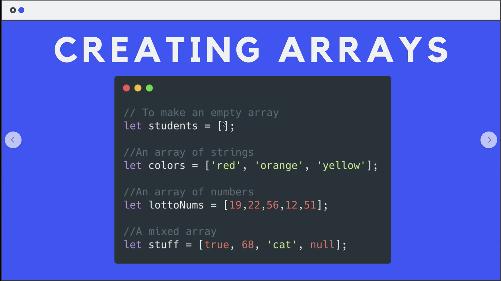

### 6.2. Modifying Arrays

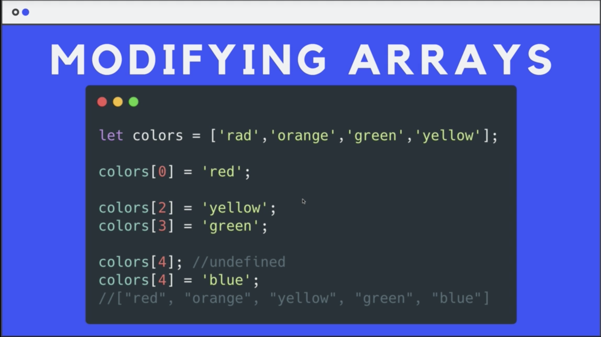

1. Arrays are Mutable (As opposed to Strings which are immutable)

#### 6.2.1. Basic Array Methods


##### 6.2.1.1. Shift and Unshift

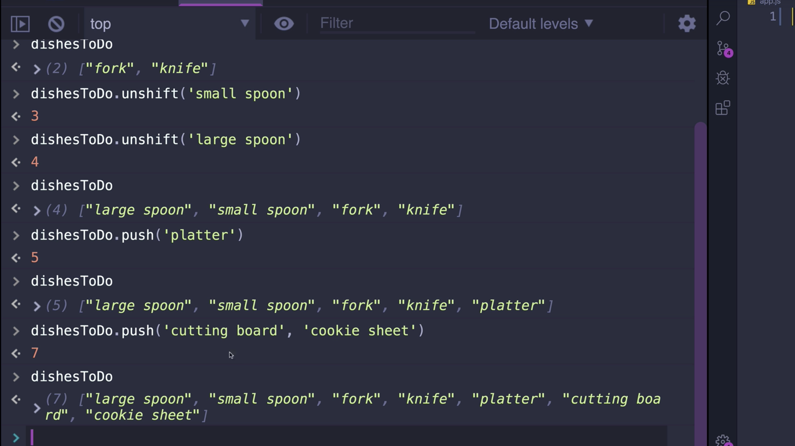

##### 6.2.1.2. Some More Methods


##### 6.2.1.3. Concat


##### 6.2.1.4. Includes

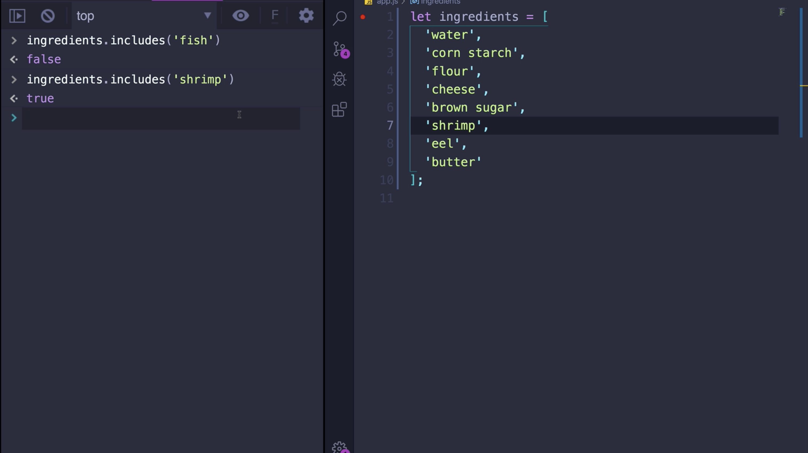

> The second argument is `indexFrom` meaning the index from which it will start
> checking for the value.

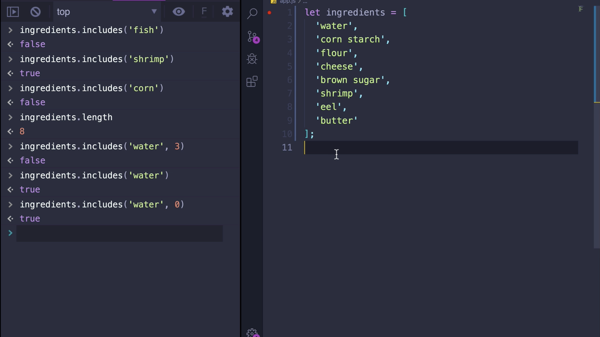

##### 6.2.1.5. Index Of


##### 6.2.1.6. Reverse

> It reverses the order of the actual array

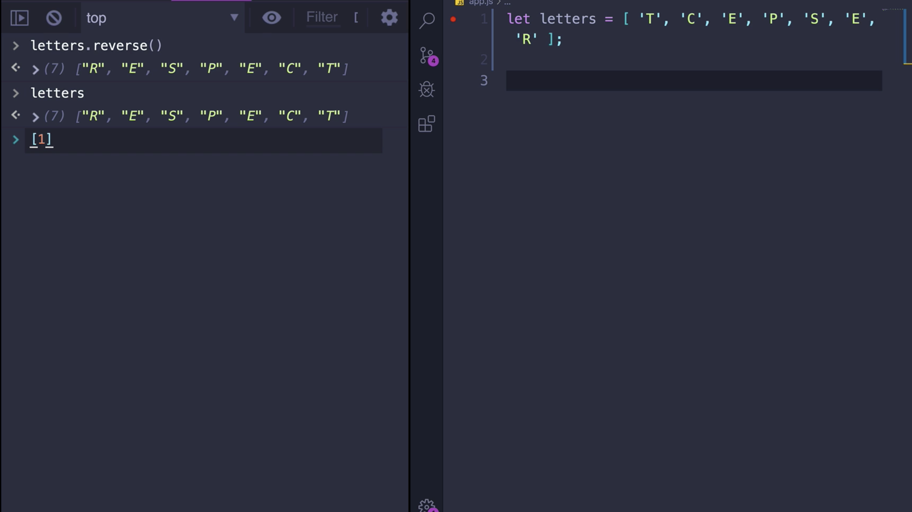

##### 6.2.1.7. Join

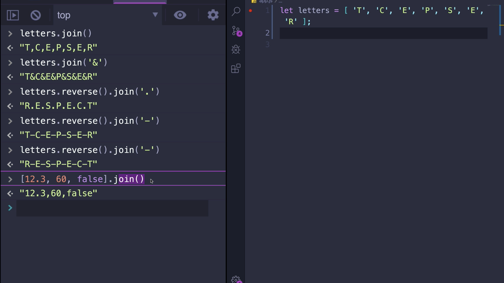

##### 6.2.1.8. Slice


```js
let animals = ["shark", "salmon", "whale", "bear"];
let swimmers = animals.slice(1, 3); // Includes index 1 upto index 3 but does not include index 3
// O/P: swimmers = ['salmon','whale']
```

##### 6.2.1.9. Splice

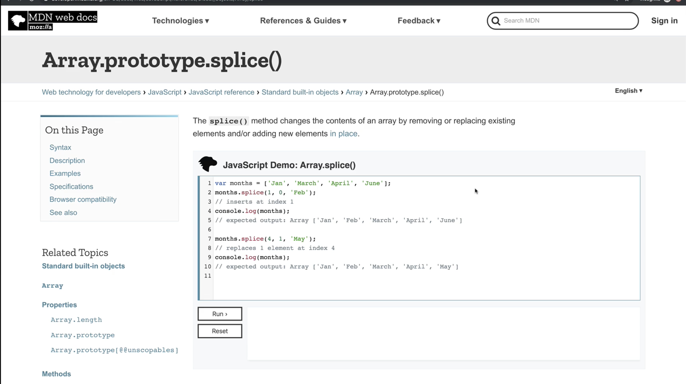

```js
let animals = ["shark", "salmon", "whale", "bear", "lizard", "tortoise"];

//splice(startIdx, deleteCount, itemsToInsert);

// =====================
// INSERTING w/ SPLICE
// =====================
// 'at index 1, delete 0 items and insert "octopus"'
animals.splice(1, 0, "octopus");
//["shark", "octopus", "salmon", "whale", "bear", "lizard", "tortoise"]

// =====================
// DELETING w/ SPLICE
// =====================
//'at index 5, delete 2 items'
animals.splice(5, 2);
//["shark", "octopus", "salmon", "whale", "bear"]

// =====================
// REPLACING w/ SPLICE
// =====================
//'at index 3, delete 2 items and replace them with "orca" and "grizzly"'
animals.splice(3, 2, "orca", "grizzly");
//Â ["shark", "octopus", "salmon", "orca", "grizzly"]
```

##### 6.2.1.10. Sort

> Sort only works properly on Strings. Instead for numbers, use compare function
> 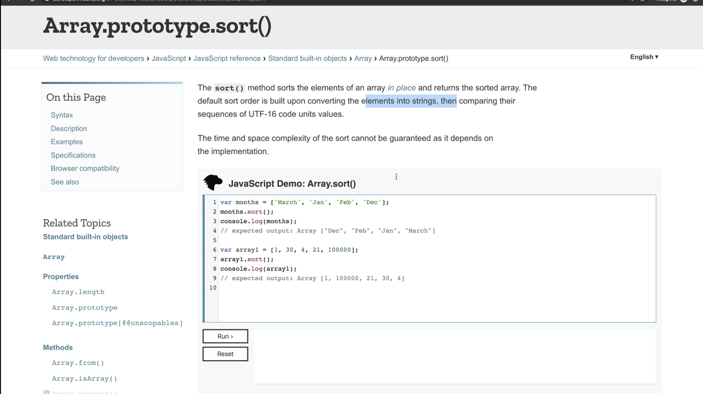

### 6.3. Reference Types

##### 6.3.0.1. By default,data is stored is a Value-Type.

#### 6.3.1. Value Types vs Reference Types

```js
// ===============
// VALUE TYPES
// ===============
//Value Types - the variable stores the actual value:

let x = 100;
let y = x;

//If we change x
x = 99;
//y is unchanged
y; //100

// ===============
// REFERENCE TYPES
// ===============

// Array variables do not hold the actual array
//Instead, they store a REFERENCE to the array

let nums = [2, 4, 6, 8];
let myNums = nums; //myNums references the same array

// If we change nums
nums.push("BOO!");

//My nums is also changed:
myNums; //[2, 4, 6, 8, "BOO!"]
```

##### 6.3.1.1. Changing arrays with Const


##### 6.3.1.2. Nested Arrays

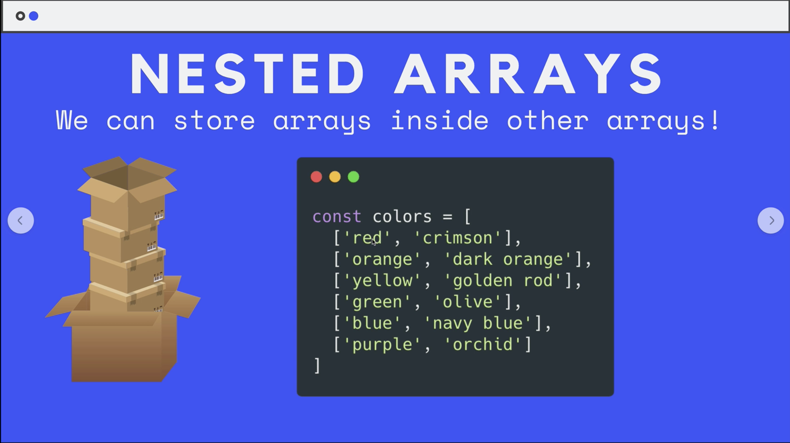

```js
const animalPairs = [
  ["doe", ["buck", "stag"]],
  ["ewe", "ram"],
  ["peahen", "peacock"],
];

//To access 'ewe'
animalPairs[1][0];

//To access 'buck'
animalPairs[0][1][0];

//Updating a sub-array:
animalPairs[0][1].push("hart");
//apparently some people call male deer 'harts'.  idk.
```

## 7. Objects

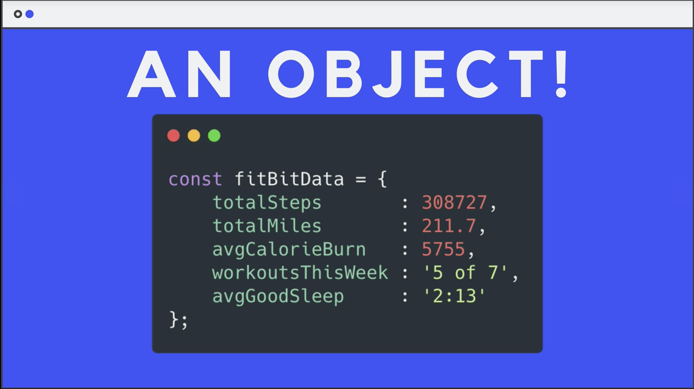


```js
// ARRAYS ARE NOT IDEAL FOR STORING ALL TYPES OF DATA.

// We could use an array if we made sure we always follow the same pattern:
//index 0: total steps
//index 1: total floors
//etc.
const fitbitData = [308756, 1814, 211];

//We have no insight into WHAT we are storing at each index

//And we could mess things up super easily if we're not careful
const lucyFitbitData = [12344, 1814, 211];

// OBJECTS TO THE RESCUE!
```

###### 7.0.0.0.1. Properties

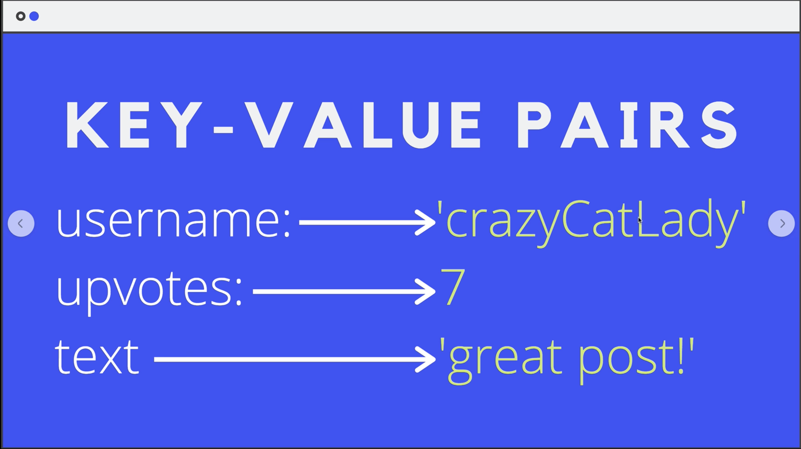

#### 7.0.1. Creating Object Literals

```js
// totalSteps  -> 308727,
// totalMiles  -> 211.7,
// avgCalorieBurn -> 5755,
// workoutsThisWeek -> '5 of 7',
// avgGoodSleep   -> '2:13's

const fitBitData = {
  totalSteps: 308727,
  totalMiles: 211.7,
  avgCalorieBurn: 5755,
  workoutsThisWeek: "5 of 7",
  avgGoodSleep: "2:13",
};
```


##### 7.0.1.1. Accessing Objects in a different way

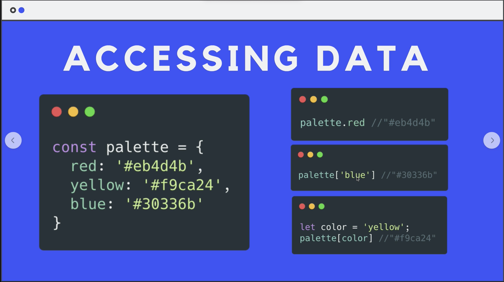

##### 7.0.1.2. Updating & Adding Properties


##### 7.0.1.3. Nested Arrays & objects


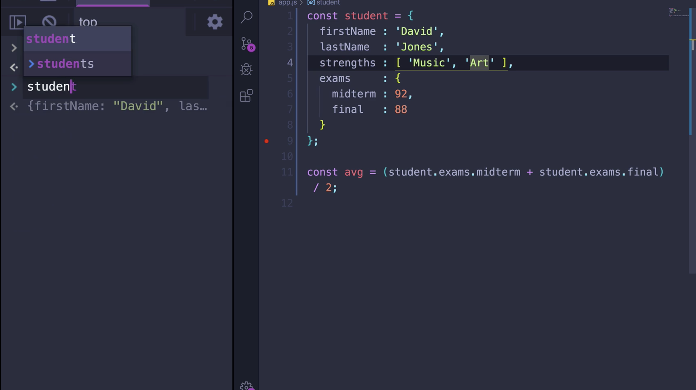

#### 7.0.2. Objects and Reference Types

> Just like arrays, objects are reference types, and 2 different variables may
> point to the same object in the memory. In this way, if the value of the array
> is changed, both the variables will now point to the updated array.

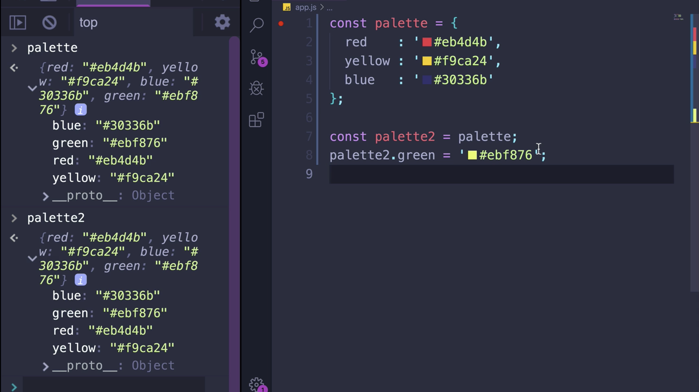

> That‘s why use const, so that we can change/update the value of the
> array/object, but we cannot change the reference of the variable to something
> entirely different.

#### 7.0.3. Array/Object Equality


## 8. The World of Loops

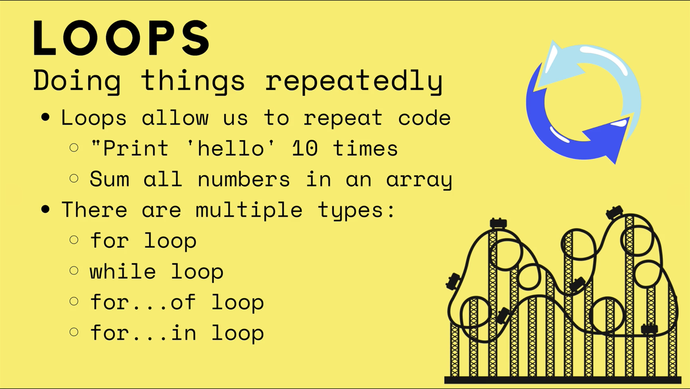

### 8.1. For Loop


### 8.2. For Loop & Arrays

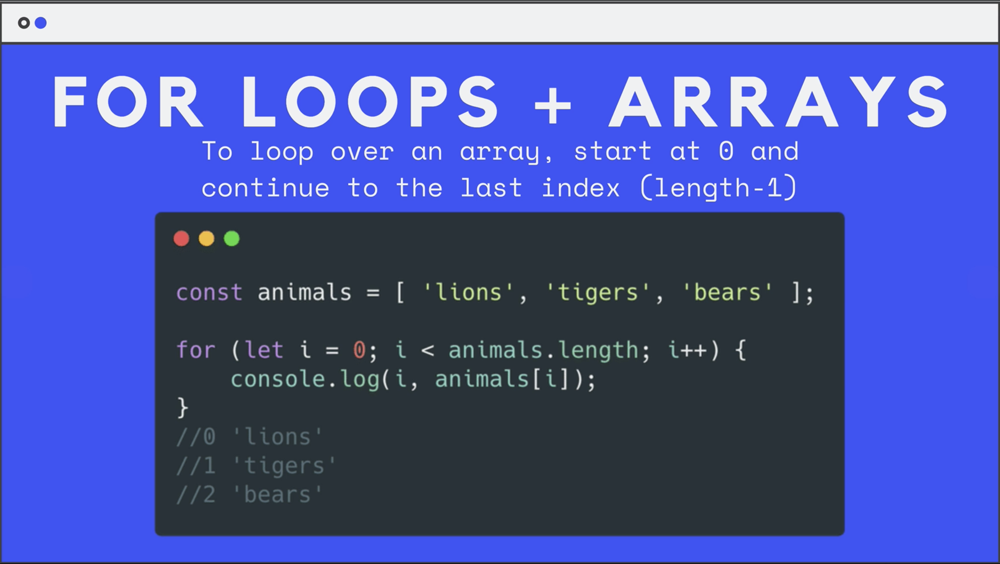

### 8.3. Nested For-Loops


### 8.4. While Loops

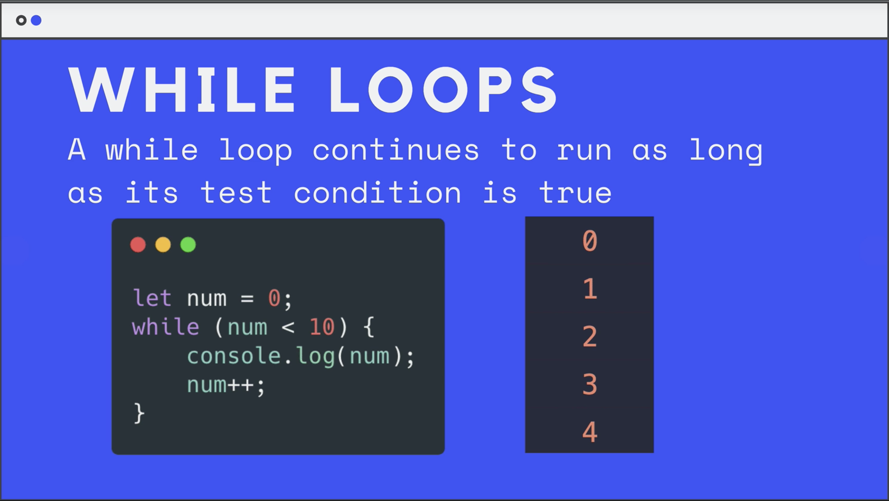

> While loops are used when you don‘t know how many times the loop is supposed
> to run!


> It‘s better to use for loops most of the time, as let is block scoped, and
> using it for several while loops while utilise more memory.

### 8.5. Break Keyword

> Break keyword is used to come out of the loop.

### 8.6. For…of Loop


#### 8.6.1. For…of Loop for Objects


#### 8.6.2. For…in Loop


## 9. Functions


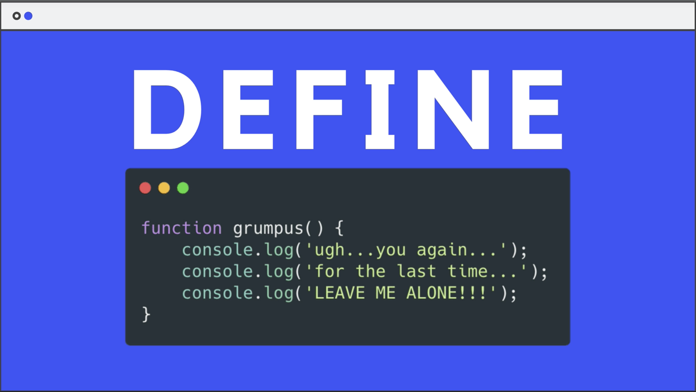
