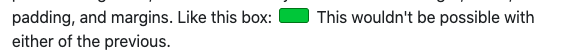

- [Css Box Model](#css-box-model)
  - [Display](#display)
  - [Width -> Padding -> Border -> and Margin](#width---padding---border---and-margin)
# Css Box Model

## Display

Every tag in CSS has a `display` property associated with it by default. 
In fact, CSS has a lot of hidden defaults, just like by-default all text's color is black. With `display`, it varies by what type of tag we're talking about. 

`div`s are `display: block;` by default while `span`s are `display: inline;` and this makes sense given their functions. However, being that we have access to CSS, we can manipulate a `span` to act like a `div`and vice-versa (though usually you'd just use the appropriate tag.) We'll list out a few of the options here of what display can be:

1. `inline` - Like it sounds, it makes whatever `tag` is, behave like text. 
   1. 💡 Here, the browser determines all the height, width, padding, margins etc. for you and **will *NOT* let you change it**.
   2. So, if you're trying to set the width or height and it's not respecting it, it's probably the wrong `display` type.
2. `block` - `div`s and `p`s are by default `display:block;`
   1. This gives you control over the height, width, padding, margins etc. of something.
   2. By default, anything that is a `block` takes the *whole line* to itself.
3. `inline-block` - A hybrid of the previous 2.
   1. This will make the browser try to place the tag inline, but still allow you to control the height, width, padding and margins.
   2. 
4. `flex` and `inline-flex` - Similar to `block`, but with some new super-powers.<!-- TODO: Add Link to FlexBox explanation here -->
5. `grid` and `inline-grid` - More advance display mode that allow you more power to layout tags inside of them. <!-- TODO: Add Link to CSS Grid and Look at Frontend Masters Tutorial-->
6. `table` - Make something act like a `table`. In general, use the `<table></table>` tag instead of using CSS to make things act like `table`s.

## Width -> Padding -> Border -> and Margin

1. `margin` – This is the space outside of the element between it and other elements. It is outside of the border. If you give something a background-color, it will not color in the margin space. This is used to space elements out from other elements.
2. `border` – Next is the border. If your element has a border, it comes next (not everything has or needs a border.)
3. `padding` – Inside the border is the `padding`. This is the spacing inside the element. If you give something a `background-color`, you will color the padding space. In our diagram above, you can see the space between the red, solid border and the green, dashed border. This is the padding of the element.

An Example:

```css

.example {
    width:100px;
    margin:4px;
    padding:20px;

}

```

Here, what does `width:100px;` mean?